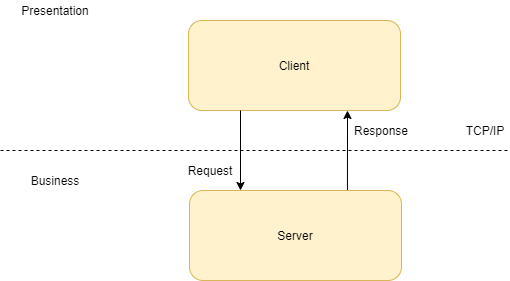

# NewBank

## Introduction
NewBank is a banking application that allows customers to interact with their accounts via a simple command-line client. 

## Architecture
The architecture is a distributed 2-tier client-server application as illustrasted below.



## Procotol
The client and server communicates via a simple protocol. 
Please refer to [Protocol document](docs/protocol.txt) for details of the application protocols between the client and the server.

## Getting Started

### Prerequisites
Download and install Apache Maven for your operating system. Visit https://maven.apache.org/download.cgi
and follow the download and installation instructions.

### Building and Running
1. **Step 1**: Clone the repository\
From a command prompt, run:
```
git clone https://github.com/Group14-Newbank/newbank.git
```

2. **Step 2**: Compile the application (from an IDE)\
Use the *Import* facility of your IDE to import an existing Maven project

**or**

2. **Step 2**: Compile the application (from the command line)\
In the root directory run:
```
mvn package
```

3. **Step 3**: Run the application\
Run the server (from the command prompt)
```
cd to target\classes
java newbank.client.NewBankServer
```

Run the client (from another command prompt)
```
cd to target\classes
java newbank.client.ExampleClient
```

## Pull Request Policy
- The branch name should always contain the task ID from Trello and a basic description, e.g. `32-add-pr-policy`.
- Take full ownership of your task: respond to the comments, update the branch, merge as soon as it's possible (so that the PR does not become stale), handle potential issues and bugs even after the merge. If no one is reviewing/responding in a timely manner, make use of the Discord channel.
- Vice versa, proactively help your team mates with their pull requests.
- Try to keep PRs small (you can split a task into subtasks), so that it's more likely the team will understand them, and less likely they will cause bugs or diverge too much from the main branch.

## Sprint 1
Our goal for this sprint is to have a basic implementation of a few commands.
